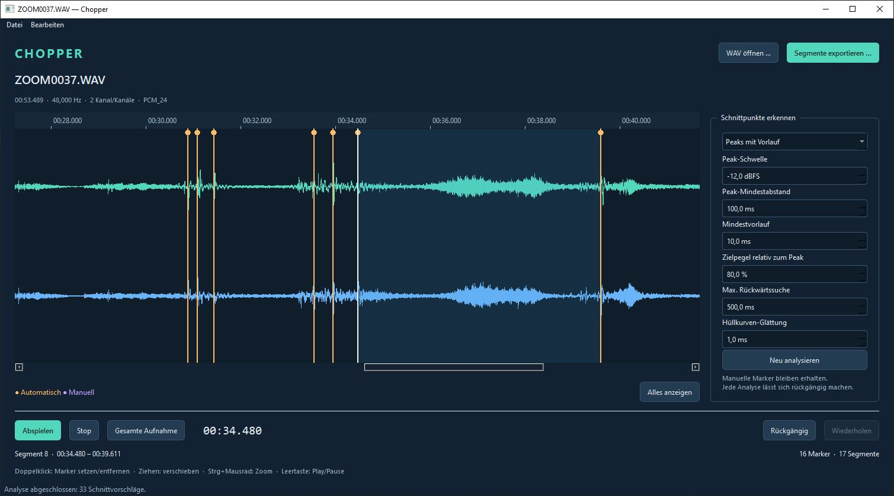

# Chopper

Kleiner WAV-Splitter für Musik und Geräusche: Peaks erkennen, Schnittmarker
korrigieren, Segmente anhören und samplegenau exportieren.




## Start unter Windows

Die vorhandene Python-Umgebung `.venv` wird verwendet. Doppelklick auf `start.bat`
öffnet die Anwendung. Alternativ in PowerShell im Projektordner:

```powershell
.venv\Scripts\python.exe -m chopper
# Optional direkt eine Datei öffnen:
.venv\Scripts\python.exe -m chopper "C:\Audio\aufnahme.wav"
```

Abhängigkeiten bei einer neuen Einrichtung:

```powershell
.venv\Scripts\python.exe -m pip install -e ".[dev]"
```

Getestete direkte Abhängigkeiten stehen in `requirements.txt`; Python 3.14 wird
in dieser Umgebung verwendet. Der Quellcode unterstützt Python ab 3.11.

## Workflow

1. Eine WAV-Datei ins Fenster ziehen oder **WAV öffnen** wählen: Die automatische
   Peak-Erkennung startet nach dem Laden. Drag-and-drop unterstützt jeweils eine
   Datei mit der Endung `.wav` oder `.wave`.
2. Bei Bedarf Erkennungsparameter rechts anpassen und **Neu analysieren** wählen.
3. Ein Segment anklicken und mit **Leertaste** abspielen/pausieren.
4. Per Doppelklick Marker setzen oder entfernen; Marker zum Korrigieren ziehen.
5. **Segmente exportieren** schreibt alle Segmente in einen gewählten Ordner.

Orange Marker sind automatisch, violette manuell. Verschobene automatische Marker
werden manuell. Eine neue Analyse ersetzt nur automatische Marker. Manuell
gelöschte automatische Vorschläge können bei einer neuen Analyse wiederkehren.
Marker werden nur während der Sitzung gehalten; es gibt keine Projektdatei.

| Bedienung | Wirkung |
| --- | --- |
| Klick in Waveform | Segment auswählen |
| Doppelklick | Marker hinzufügen / getroffenen Marker entfernen |
| Marker ziehen | Sampleposition verändern, ohne Nachbarmarker zu überholen |
| Mausrad | Horizontal scrollen |
| Strg + Mausrad | Um Mausposition zoomen |
| Alles anzeigen | Gesamte Waveform einpassen |
| Leertaste | Ausgewählten Bereich abspielen / pausieren |
| Stop | Auf Bereichsanfang zurücksetzen |
| Gesamte Aufnahme | Segmentauswahl aufheben, zum Dateianfang |
| Links / Rechts in der Waveform | 100 ms zurück / vor |
| Entf | Gewählten Marker entfernen |
| Strg+Z / Strg+Umschalt+Z | Rückgängig / Wiederholen |
| Strg+O / Strg+E | Öffnen / Exportieren |

## Peak-Erkennung

Beim Öffnen wird die initiale Peak-Schwelle aus der Datei geschätzt. Ziel sind
etwa 10 Peaks, bei längeren Dateien etwa 6 Peaks pro Minute (der größere Wert
gilt). Die Schätzung berücksichtigt Glättung und Mindestabstand und prüft
Schwellen in 0,1-dB-Schritten. Bei weniger verfügbaren oder gleich hohen Peaks
wird die nächstmögliche Anzahl verwendet; bei Stille bleibt es bei −24 dBFS.
Der geschätzte Wert erscheint im Eingabefeld. **Neu analysieren** verwendet
anschließend die manuell eingestellten Werte. Die Anzahl der Schnittmarker
kann geringer sein als die Peak-Anzahl, etwa bei Peaks direkt am Dateianfang.

Die geglättete Hüllkurve verwendet den jeweils höchsten Absolutwert aller Kanäle.
Lokale Maxima oberhalb der Schwelle werden nach Stärke ausgewählt; der
Mindestabstand unterdrückt dicht benachbarte Peaks. Plateaus ergeben einen Peak
in ihrer Mitte. Dateiränder sind keine Peaks.

Ab **Peak minus Mindestvorlauf** wird rückwärts der nächste Punkt mit höchstens
dem **Zielpegel relativ zum Peak** gesucht. 25 % meint ein Viertel der linearen
Amplitude. Die Suche ist zeitlich begrenzt und überschreitet den vorherigen Peak
nicht. Ohne Treffer wird der Mindestvorlauf verwendet. Passt dieser vor einem
Peak nicht in den verfügbaren Bereich, entfällt dessen Vorschlag. Vorschläge an
Sample 0 und doppelte Schnittpunkte entfallen ebenfalls.

Dies ist bewusst eine einfache Ausgangsbasis, keine vollständige musikalische
Onset-Erkennung. Einstellungen wirken erst bei der nächsten Analyse. Änderungen
an Markern während einer Analyse führen zum Verwerfen ihres Ergebnisses.

### Andere Algorithmen ergänzen

In `chopper/detectors.py` implementiert ein Algorithmus das Qt-unabhängige
`Detector`-Protokoll:

```python
def detect(self, samples, samplerate, parameters) -> list[int]:
    # samples: [Frames, Kanäle], float64; Rückgabe: ganzzahlige Samplepositionen
    ...
```

Ein `DetectorSpec` mit eindeutiger ID, Anzeigename, Algorithmusinstanz und einer
Liste numerischer `Parameter` wird über `register(spec)` registriert. Die GUI
erzeugt Auswahl und Parameterfelder daraus. Neue Module müssen vor Erstellung
des Hauptfensters importiert werden. Detektoren verändern keine Audiodaten.

## Audio und Export

Unterstützt werden PCM-WAV (8/16/24/32 Bit) und Float-WAV (32/64 Bit), auch WAVEX
und RF64 als Eingang. Exportiert wird WAV mit gleicher Samplerate, Kanalzahl und
Sampleformat. Die Samplefolge bleibt erhalten; es gibt weder Fades noch
Normalisierung. Zusätzliche WAV-Metadaten werden nicht übernommen.

Die Namen lauten `aufnahme_001.wav`, `aufnahme_002.wav`, … . Vorhandene Dateien
werden niemals überschrieben. Bei einem Fehler werden abgeschlossene Dateien
gemeldet und unvollständige Dateien nach Möglichkeit entfernt.

Audio läuft über das Standardausgabegerät. Kanalzahl und Samplerate müssen vom
Gerät unterstützt werden; es gibt kein automatisches Downmixing oder Resampling.
Ausgabeprobleme verhindern weder Markerbearbeitung noch Export. Der Player nutzt
Float32 für die Geräteausgabe, der Export die unveränderten Float64-Quelldaten.

## Codequalität und Tests

mypy und Ruff werden mit den Entwicklungsabhängigkeiten (`.[dev]`) installiert.
Die gemeinsame Prüfung startet mit:

```powershell
.\check.bat
```

Sie prüft Ruff-Regeln, Formatierung, Typen und anschließend alle Tests und bricht
beim ersten Fehler ab. Die Einstellungen stehen zentral in `pyproject.toml`:

- Ruff vereinheitlicht Imports und Formatierung auf 100 Zeichen Zeilenlänge.
- Alle Funktionen und Methoden in `chopper/` benötigen Parameter- und
  Rückgabetypen, einschließlich `-> None` bei Methoden ohne Ergebnis.
- mypy prüft den gesamten Anwendungscode mit der aktiven Python-Version.
  Fehlende externe Typinformationen werden nur für `soundfile` und
  `sounddevice` toleriert. Die Audio-Callback-Schnittstellen sind über eigene
  Protokolle beschrieben.
- Testdateien werden formatiert und auf Ruff-Regelverstöße geprüft; vollständige
  Typannotationen sind dort nicht vorgeschrieben. mypy prüft `chopper/`.

Formatierung und automatisch korrigierbare Regelverstöße beheben:

```powershell
.venv\Scripts\python.exe -m ruff check . --fix
.venv\Scripts\python.exe -m ruff format .
```

Prüfungen einzeln ausführen:

```powershell
.venv\Scripts\python.exe -m ruff check .
.venv\Scripts\python.exe -m ruff format --check .
.venv\Scripts\python.exe -m mypy
.venv\Scripts\python.exe -m pytest
```

Die Tests prüfen Detektor, Dokument/Undo, Export-Roundtrips, simulierte
Audiowiedergabe sowie Qt-Interaktionen ohne sichtbares Fenster. Die tatsächliche
Tonwiedergabe muss zusätzlich mit dem eigenen Ausgabegerät angehört werden.

Temporäre Testdateien liegen pro Prüflauf in einem eigenen Ordner unter
`.artifacts/pytest/` und werden anschließend entfernt. Das gilt auch bei direktem
pytest-Aufruf und in PyCharm und vermeidet Zugriffsprobleme mit dem gemeinsamen
Windows-Temp-Ordner. Ein explizites `--basetemp` überschreibt diese Vorgabe.

Der persistente pytest-Cache ist deaktiviert, damit Prüfläufe nicht auf einen
unter einem anderen Windows-Benutzer angelegten Cache zugreifen. Alle Tests
laufen weiterhin; Cache-Funktionen wie `--last-failed` stehen nicht zur Verfügung.

Das vollständige Konzept steht in [CONCEPT.md](CONCEPT.md).
